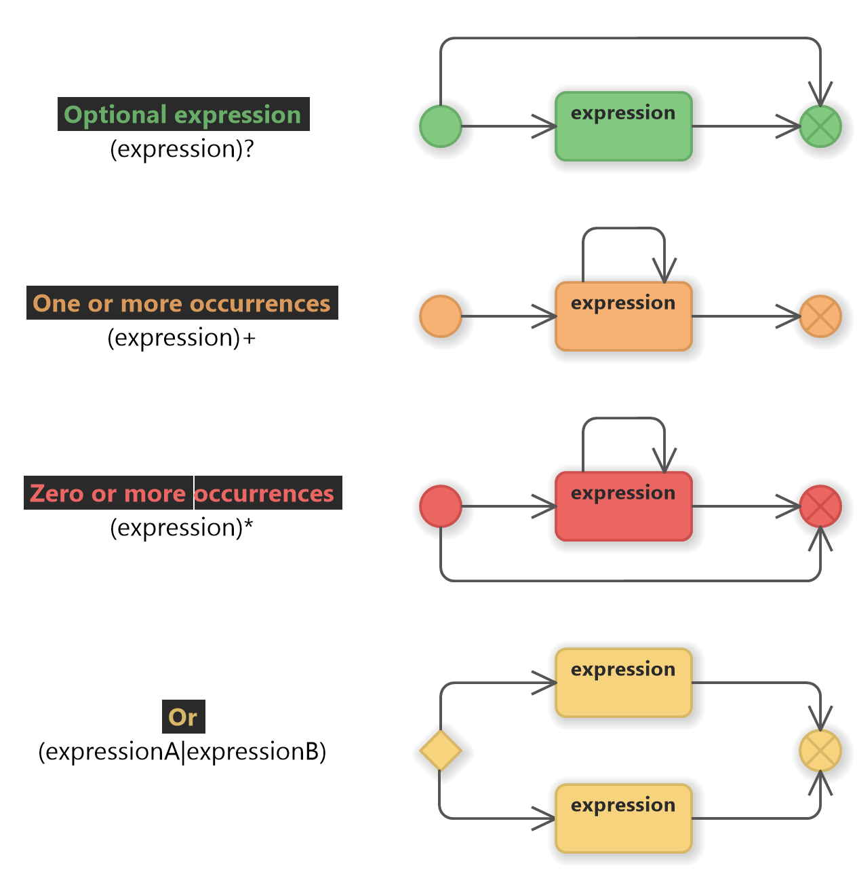
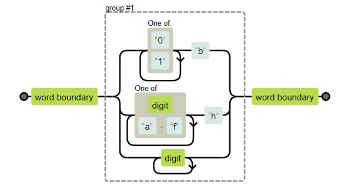

# Chapter 9
## Regular Expressions:
- `Regular expressions` are a way to describe patterns in string data.
- A powerful tool for inspecting and processing strings.

### Creating a regular expressions:
- Regular expression is a type of object. using `RegExp` constructor or written as a literal value by enclosing pattern in forward slash (/).
```js
let re1 = new RegExp("abc");
let re2 = /abc/;
```
- Some characters, such as question marks and plus signs, have special meanings in regular expressions and must be preceded by a "backslash" if they are meant to represent the character itself.

### Testing for matches:
- Regular expression objects have a number of methods.
- `Test` method will return boolean telling you whether the string contains a match of the pattern in the expression.
```js
console.log(/abc/.test("abcde"));
// true
console.log(/abc/.test("abxde"));
// false
```

### Sets of characters:
- Putting a set of characters between square brackets makes that part of the expression match any of the characters between brackets.
```js
console.log(/[0123456789]/.test("in 1992"));
// true
console.log(/[0-9]/.test("in 1992"));
// true
```
- The `hyphen` (-) between two character used to indicate a range of characters. (ordered by Unicode number)
- Number of common charater groups have their own buit-in shortcuts.
[
    `\d` Any digit character.
    `\w` word character.
    `\s` whitespace.
    `\D` not a digit.
    `\W` not a word character.
    `\S` nonwhitespace.
]
- To match a date and time format like `01-30-2003 15:20`:
```js
let dateTime = /\d\d-\d\d-\d\d\d\d \d\d:\d\d/;
console.log(dateTime.test("01-30-2003 15:20"));
// true
```
- To `invert` a set of characters that is to express that ypou want to match any charater "except" the ones in the set. you write a caret `(^)` after the opening bracket.

### Repeating parts of a pattern:
- Putting a plus sign (+) after something in a regular expression, it indicates that it may be repeated more than once.
```js
console.log(/'d+'/.test("'123'"));
// true
console.log(/'d+'/.test("''"));
// false
console.log(/'d*'/.test("'123'"));
// true
console.log(/'d*'/.test("''"));
// true
```
- The start (*) same as (+) but it accepts zero or more times.
- A question mark makes part of the pattern `optional` meaning it may occur zero times or one time.
```js
let neighbor = /neighbou?r/;
```
- To indicate a pattern should occur a precise number of times. putting `{4}` or a range by `{2,4}` at least twice at most four times or `{5,}` five or more times.
```js
let dateTime = /\d{1,2}-\d{1,2}-\d{4} \d{1,2}:\d{2}/;
console.log(dateTime.test("01-30-2003 15:20"));
// true
```

### Grouping Subexpressions:
- To use operator like `*` or `+` on more than one element at a time, you should use parentheses. 
- A part of a regular expression that is enclosed in parentheses counts as a single element.
```js
let cartoonCrying = /boo+(hoo+)+/i;
console.log(cartoonCrying.test("Boohoooohoohooo"));
// true
```
- The `i` at the end of the expression makes the regular expression "case insensitive".

### Matches and groups:
- The `exec` method that will return `null` if no match was found and return an abject wiht information about the match.
```js
let match = /\d+/.exec("one two 100");
console.log(match);
// ["100"]
console.log(match.index); 
// 8
```
- An object returned from `exec` has an `index` property that tells us where in the string the successful match begins.
- When regular expression contains subexpressions grouped with parentheses, will show up in the array The whole match is always the first element, the next element is the part matched by the first group.
```js
let quotedText = /'([^']*)/;
console.log(qoutedText.exec("she said 'hello'"));
// ["'hello'", "hello"]
```
- When a group does not end up being matched at all its position in the output array will hold `undefined`, and when a group is matched multiple times, only the last match ends up in the array.
```js
console.log(/bad(ly)?/.exec("bad"));
// ["bad", undefined]
console.log(/(\d)+/.exec("123"));
// ["123", "3"]
```

### The date class:
- JavaScript has class for representing dates called `Date`.
- You can get current date and time using `new`, or you can pass arguments of day, month and year. (note months starts at zero, so zero represents january)
```js
console.log(new Date());
// Tue Oct 31 2023 13:33:07 GMT+0200
console.log(new Date(2001, 8, 6));
// Thu Sep 06 2001 00:00:00 GMT+0300
```
- We can pass the time after the date arguments (hour, minutes, seconds), or just one argument that represents `milliseconds`.
- `getTime` method returns the milliseconds of any datetime specified.
```js
console.log(new Date(2013, 11, 19).getTime());
// 1387407600000
```
- Date objects provide methods (`getFullYear` or `getYear`, `getMonth`, `getMonth`, `getDate`, `getHours`, `getMinutes`, `getSeconds`)
```js
function getDate(string) {
    let [_, month, day, year] = /(\d{1,2})-(\d{1,2})-(\d{4})/.exec(string);
    return new Date(year, month - 1, day);
}
console.log(getDate("1-30-2003"));
// Thu Jan 30 2003 00:00:00 GMT+0100 (CET)
```
- The (_) underscore binding is ignored and used only to skip the full match element returned by `exec` method.

### Word and string boundaries:
- To enforce the match must span the whole string, we can add markers `^` and `$`, the caret `^` matches the start of the string and `$` matches the end of the string.
- The marker `\b` a word boundary can be the start or end of the string or any point in the string that has word character on one side and nonword character on the other.
```js
console.log(/cat/.test("concatenate"));
// true
console.log(/\bcat\b/.test("concatenate"));
// false
```

### Choice patterns:
- The "pipe" character (|) denotes a choice between the pattern to its left and pattern to its right.
```js
let animalCount = /\b\d+ (pig|cow|chicken)s?\b/;
console.log(animalCount.test("15 pigs"));
// true
console.log(animalCount.test("15 pigchickens"));
// false
```

### The mechanics of matching:
- When you use `exec` or `test`, the regular expression "engine" looks for a match in your string by trying to match the expression first from the start of the string, then from the second character and so on..
- This images explains it, the flow diagram of a regular expression.


### Backtracking:
- The regular expression `/\b([01]+b|[\da-f]+h|\d+)\b/`.

- When matching "103", at while going to the binary branch at "3" number it know it's on the wrong branch, so the `matcher` backtracks.
- When entering a branch, it remembers its current position.
- It will start trying the branch for hexadecimal numbers, which fails again because there is no `h` after the number.
- The matcher stops as soon as it finds the full match.
- It tests multiple branches according to the ordering where the branches appear in the regular expressions.
- Backtracking also happens for repetition operators (`+`, `*`).

